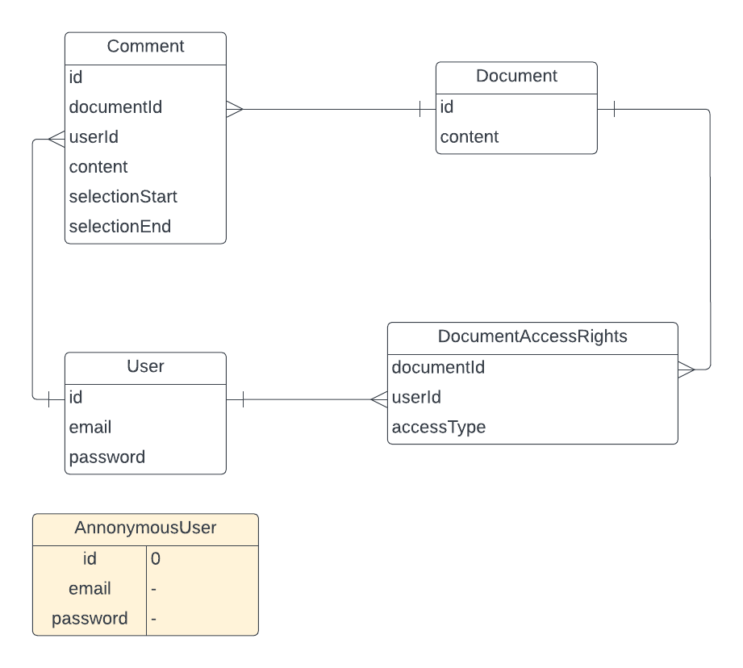

# Documentation

## Introduction

The site is built on the following technologies:

- NextJS & React - client
- Supabase - serverless backend and database provider
- Mantine - UI library for rendering

Why these technologies?

- **NextJS & React**
  - due to assignment constraints
  - personal experience
- **Supabase**
  - assignment guidelines to use Postgres with an ORM
  - trendy tech and figured it would be a nice opportunity to try it out
  - integrates great with Next/React, provides TypeScript support for database tables
  - immense time saver
  - easy to implement authentication
- **Mantine.dev**
  - easy to setup, feature-rich UI library with components, hooks, form controls, etc.

## Database overview

The database has a simple structure:

To treat anonymous users, there is a dummy user in the database, which we treat as the source of truth for non-logged users when determining their access.

Access types are defined in the code.

## Authentication

The authentication is fully provided by Supabase, down to the login/register react component.

## Problems with current implementation

Naturally, due to the nature, size of the task and limited time, there had to be some trade offs and an optimal solution cannot be provided. Therefore, some areas where I have identified possible issues:

- **Security** - some of the read/write checks are done on client-side and the policies that exist in Supabase might not have been setup properly to handle unauthorized access to some files
- **UI/UX of already given rights** - due to limited time available I could not implement an overview of who has access to a specific document. Access can be overwritten by using the "Share" function and providing the new access level. There is no user interface to perform DELETE operations on the DocumentAccessRights table and therefore rights cannot be revoked currently, only manually from DB.
- **UI/UX of commenting for specific part of document** - to make a comment only for a specific part of the document, you need to type in your comment first, then highlight the text its about and press "Add comment".
- **Visualizing comments about part of document** - the implementation deviates from the task definition due to limited time for research how this can be implemented. Highlighted part shows as part of the comment, not part of the document. Due to the highlighting component used from Mantine, if the same highlighted text exists in two or more places, it will be highlighted everywhere.

# How to use?

Since there is no navigation in the application here are some routes which are defined:

- `/` - home page, create new documents, list documents of which the user owns
- `/login` - sign in or sign up features, provided by Supabase
- `/document/:id` - preview, comment on document if the correct access rights are found

Sharing a file:

- To share a file, the user that is being invited must already have an account in the system. This is again due to the time limitation to implement invite system.
- To invite a user, type in their email or check "Anyone with the link" to share to anonymous users
- Only registered users can leave comments

## Test accounts

To save you the hustle of registering a new account you can use existing:

- jayeham907@wiroute.com : 123123123
- hilevel145@wiroute.com : 123123123
